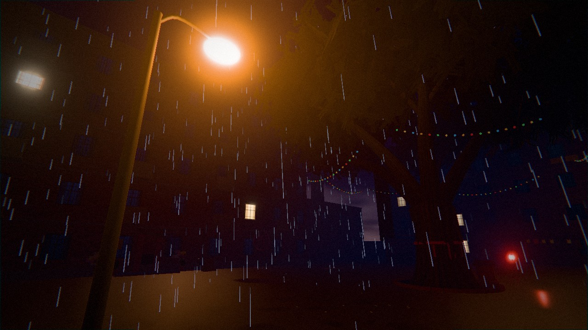
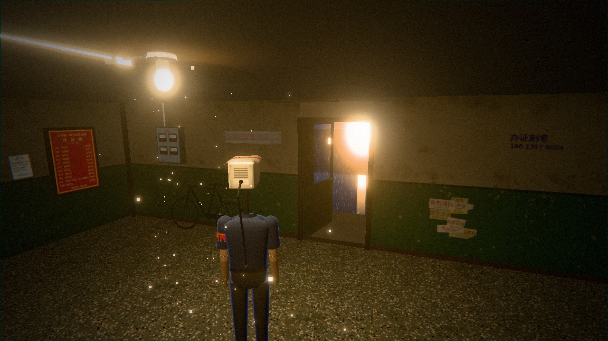
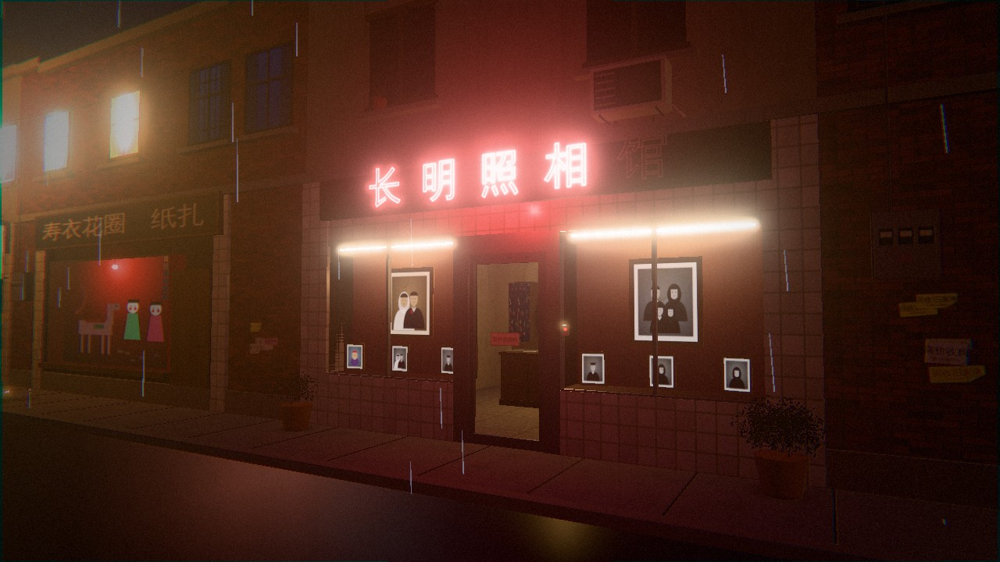
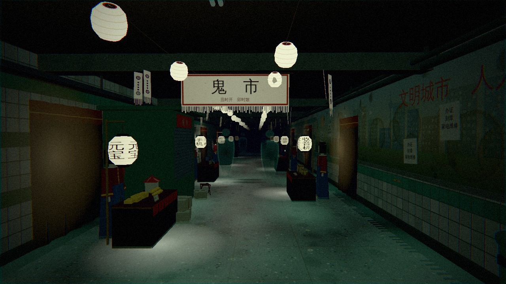
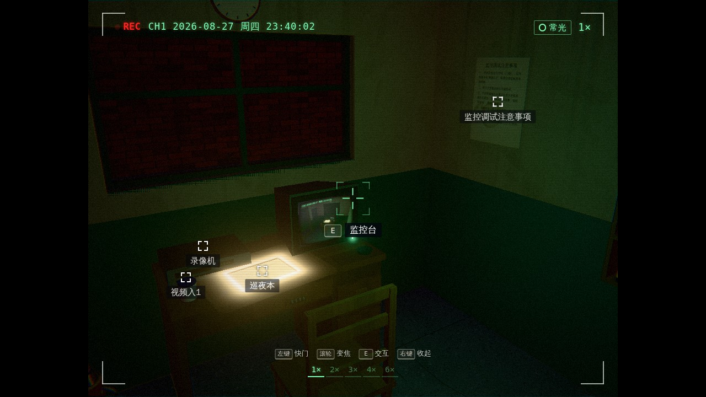
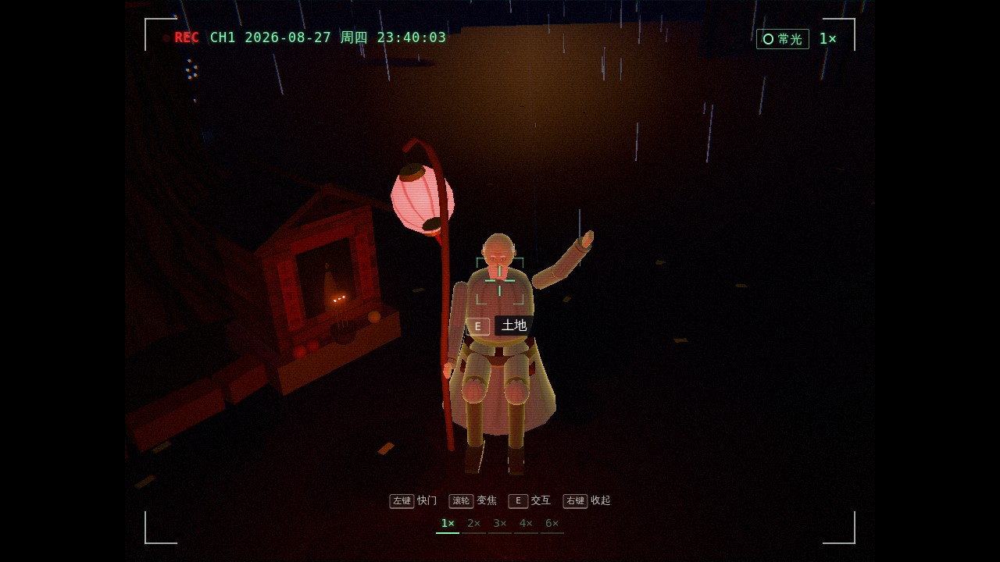
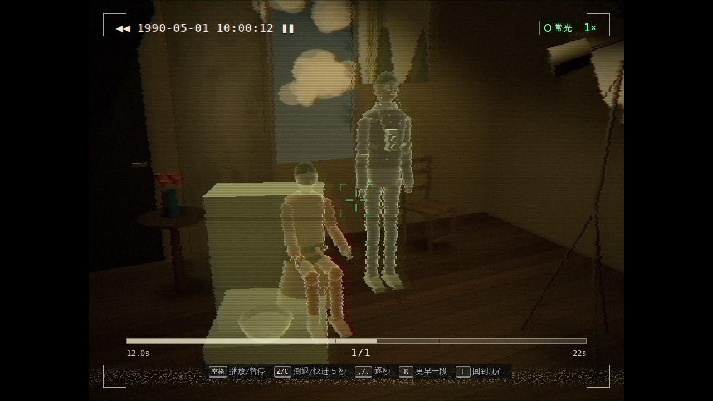
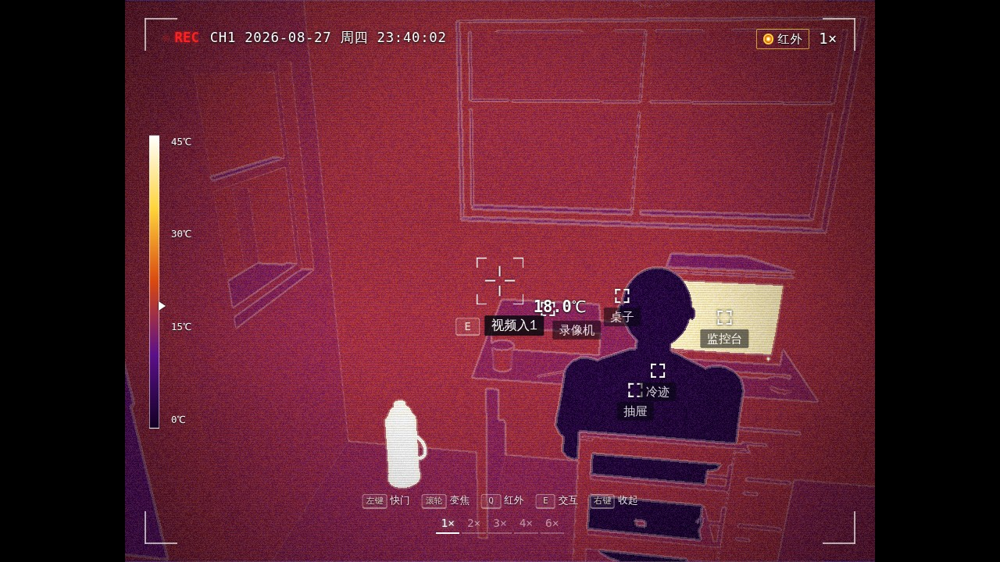

# 天亮了，叫我 · 槐安里·七月半

一款在浏览器里玩的 3D 都市志怪解谜游戏。

你是槐安里老小区门岗上那台看了二十二年大门的监控摄像头。拆迁前最后一个七月半的夜里，你借了老周的一块魂，长出了人的身子，脖子上却还是那颗摄像头。天亮以前，你要把回家的街坊一个个送走，最后把那一块魂还回去。

- 非战斗：探索、找线索、解谜、和人（或不是人）说话。
- 主角的头就是玩法：取景器能看见肉眼看不见的东西，快门能拍下证据，倒带能看见并拍下此地的过去，红外能照出冷热，还有录像机、监控台和镜子。
- 4 个区域：槐安里、三号楼（含 502）、老街长明照相馆、人民路地下通道鬼市。14 个谜题，一个主结局，一个隐藏结局“南柯”。
- 首次通关大约 40–55 分钟（估算，尚未用真人计时）。
- 零外部资源：模型全部程序化生成，贴图用 Canvas 画，声音用 WebAudio 实时合成。

**[在线试玩](https://evegoodevening.github.io/camhead-man/)**

存档保存在当前站点的浏览器 localStorage；换设备、浏览器或站点地址不会自动迁移。

## 游戏画面

四个区域，以及取景器、倒带与红外玩法。以下为 1280 × 720 高画质实机截图，不含结局画面；点击图片可查看原图。

<table>
  <tr>
    <td width="50%" valign="top">
      <a href="docs/screenshots/huai-an-courtyard.jpg"></a><br>
      <strong>槐安里 · 雨夜庭院</strong><br>
      古槐压着院子，钠灯照亮湿地面，旧楼上还留着几扇亮窗。
    </td>
    <td width="50%" valign="top">
      <a href="docs/screenshots/building-three.jpg"></a><br>
      <strong>三号楼 · 声控灯下</strong><br>
      跟着伙计走进楼道，在信报箱、小广告与旧电表之间找线索。
    </td>
  </tr>
  <tr>
    <td width="50%" valign="top">
      <a href="docs/screenshots/changming-photo-studio.jpg"></a><br>
      <strong>老街 · 长明照相馆</strong><br>
      雨夜里的红霓虹，玻璃门后的旧照片与未了心事。
    </td>
    <td width="50%" valign="top">
      <a href="docs/screenshots/ghost-market.jpg"></a><br>
      <strong>人民路地下通道 · 鬼市</strong><br>
      灯笼阵亮起来，两排纸人守着摊位，通道里开始做另一种买卖。
    </td>
  </tr>
  <tr>
    <td width="50%" valign="top">
      <a href="docs/screenshots/gatehouse-viewfinder.jpg"></a><br>
      <strong>门卫室 · 一夜的起点</strong><br>
      巡夜本、录像机和 CRT 监控屏，都是这颗摄像头熟悉的东西。
    </td>
    <td width="50%" valign="top">
      <a href="docs/screenshots/earth-god-viewfinder.jpg"></a><br>
      <strong>取景器 · 看见另一边</strong><br>
      换成伙计的眼睛，与肉眼看不见的街坊打个照面。
    </td>
  </tr>
  <tr>
    <td width="50%" valign="top">
      <a href="docs/screenshots/rewind-wedding.jpg"></a><br>
      <strong>倒带 · 拍下过去</strong><br>
      回到 1990 年的影棚，让一场旧日婚礼重新进入镜头。
    </td>
    <td width="50%" valign="top">
      <a href="docs/screenshots/infrared-traces.jpg"></a><br>
      <strong>红外 · 辨认冷暖</strong><br>
      切换“火眼”，从暖壶、监控屏和椅子上的冷迹里发现异常。
    </td>
  </tr>
</table>

## 运行

需要 Node.js 20.19+ 或 22.12+（Vite 8 的要求），以及支持 WebGL 2 的桌面浏览器（Chrome、Edge 或 Firefox），用键盘和鼠标操作。

```bash
npm install
npm run dev        # 打开终端里显示的地址（默认 http://localhost:5173）
```

或者构建后预览：

```bash
npm run build
npm run preview
```

第一次点击画面时会锁定鼠标并开启声音。进度会自动存到浏览器的 localStorage。

## 操作

| 键 | 作用 |
|---|---|
| WASD / 鼠标 | 移动 / 转视角（Shift 快走） |
| E | 交互（交谈、查看、出示、使用） |
| 右键 | 进入 / 退出取景器（用“伙计”的眼睛看） |
| 左键 | 取景器里按快门拍照 |
| 滚轮 | 取景器里变焦（1×–6×） |
| Q | 取景器里切换常光 / 红外（拿到“火眼”之后） |
| R / F | 在残影旁倒带 / 回到现在（回放中：空格播放暂停，Z/C 前后 5 秒） |
| Tab | 相册与物品 |
| J | 巡夜本（线索、称呼） |
| H | 提示（分三级） |
| Esc | 暂停菜单、设置 |

录像机面板：空格播放 / 暂停，按住 Z/C 倒退 / 快进，逗号 / 句号逐秒，[ ] 跳索引点。监控台：1–5 切频道。完整按键表见 `docs/GDD.md` §10.1。

设置里可以调：
- 音量、画质、字幕字号
- 鼠标灵敏度、Y 轴反转、取景器“切换 / 按住”
- 颗粒与色差强度、减少闪光、色彩辅助
- 提示无冷却
- 镜面和照妖镜的实时 / 预制模式（机器吃力时用“预制”）

## 第三方许可与字体

见 [第三方许可声明](public/THIRD_PARTY_NOTICES.txt)（`THIRD_PARTY_NOTICES.txt`），也可从游戏标题页的「第三方许可」查看。

标题页的「第三方许可」入口可在游戏内阅读完整声明，支持鼠标滚轮、方向键及 PageUp / PageDown 滚动，点击「返回」或按 Esc 回到标题页。正文直接从 [THIRD_PARTY_NOTICES.txt](public/THIRD_PARTY_NOTICES.txt) 导入，其中包含系统字体使用说明及 Three.js 的完整 MIT 许可证，不另存一份文案。

本项目不包含或分发字体文件；界面和运行时生成的文字纹理使用用户设备上可用的系统字体，实际字体取决于设备环境。各字体的权利归其相应权利人所有。

构建时 Vite 将该声明原样复制为 `dist/THIRD_PARTY_NOTICES.txt`，随 GitHub Pages 一起发布，部署后可在站点的 `THIRD_PARTY_NOTICES.txt` 路径访问。发布包应保留此文件；更新第三方组件或引入字体文件时，应同步核对并更新声明。第三方许可证不代表本游戏原创代码或内容的许可证。
